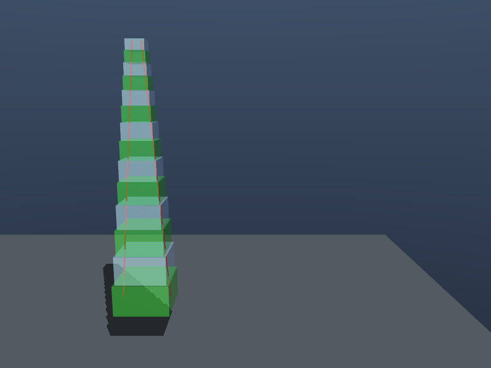
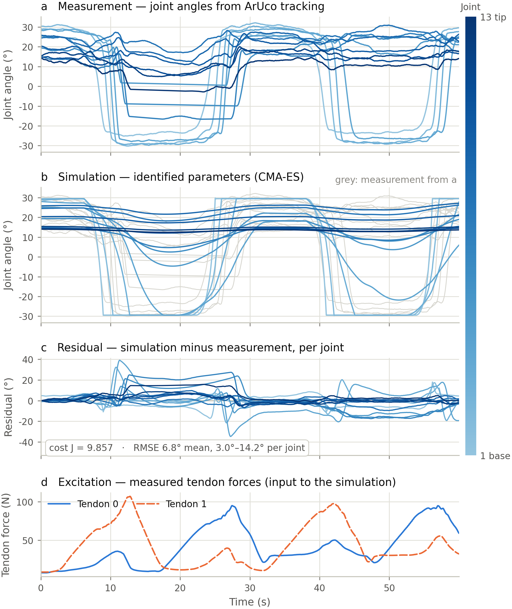

# SpiRob — Model, System Identification & Reinforcement Learning

MuJoCo model generation, experimental parameter identification and
reinforcement learning for the **SpiRob**: a 3D-printed, tendon-driven
quasi-continuum robot whose body follows a logarithmic spiral. The identified
model is what the policies in [`rl/`](rl/) train on.

<p align="center">
  
</p>

---

## TL;DR

* A **13-joint MuJoCo model** is generated from four numbers (length, base
  diameter, tip diameter, discretisation step) — [`scripts/generate_model.py`](scripts/generate_model.py).
* Joint stiffness and damping were measured **two ways** on the real robot
  (static load test on a robot arm + precision scale; free-vibration ring-down
  with an accelerometer) and **fitted a third way** (replaying measured tendon
  forces in MuJoCo and optimising with CMA-ES).
* The three methods **disagree**, and the fitted parameters are physically
  implausible. That is the actual result:
  **the sim-to-real gap here is a modelling problem, not an optimisation problem.**
  The rigid-chain + torsion-spring model has no term for tendon friction in the
  guide rings, TPU non-linearity or joint coupling, so the optimiser compensates
  with numbers that minimise cost but mean nothing physically.
* Practical consequence for RL: **do not train on one calibrated parameter set.**
  Use these values as the centre of a domain-randomisation range — which is
  exactly what [`rl/`](rl/) does: four tasks (reach, shape, trajectory, wrap) ×
  five levels of actor observability, trained in
  [mjlab](https://github.com/mujocolab/mjlab) with a domain-randomisation
  curriculum on top of the identified model.



*Real-to-sim identification with CMA-ES after 500 iterations. (a) measured joint
angles from ArUco tracking, (b) simulation with the identified parameters
(measurement in grey behind it), (c) residual per joint, (d) the measured tendon
forces driving the simulation. Mean RMSE 6.8°, ranging from 3.0° to 14.2° per
joint — the optimiser reproduces the gross motion but not the trajectory.*

---

## Results at a glance

**Torsional stiffness of the four measured joints, N·m/rad**

| Joint | Static load test | Free vibration | Deviation |
|---|---:|---:|---:|
| 1 (base) | 0.511 | 0.670 | +31 % |
| 8 (middle) | 0.226 | 0.832 | +262 % |
| 11 | 0.293 | 0.370 | +26 % |
| 13 (tip) | 0.266 | 0.692 | +160 % |

The dynamic test consistently reports *higher* stiffness. Part of that is real —
TPU is viscoelastic, so apparent stiffness is frequency-dependent — and part is
measurement error, chiefly the estimated moment of inertia `J`, which enters
`k = ω₀²J` linearly. That `J` is a guess is visible in the one quantity that does
*not* depend on it: the damping ratio `ζ` follows from the logarithmic decrement
alone and comes out at 0.13 ± 0.01 across all four joints.

Neither measurement follows the smooth base-to-tip taper the spiral geometry
would suggest, which is attributable to 3D-printing effects (the base joints are
printed with infill, the tip joints as solid TPU).

**Optimiser comparison (sim-to-sim, equal evaluation budget)**

CMA-ES beats Differential Evolution: better parameters at less compute, and it
terminates early on its own stagnation criterion instead of burning the budget.
Across every configuration, tendon stiffness is recovered to within 5 %, joint
damping to 4–31 %, but joint **stiffness only to 28–158 %** — it is barely
identifiable from trajectory data.

---

## Installation

Everything is managed with [**uv**](https://docs.astral.sh/uv/). No pip, no
conda, no manual virtualenv.

```bash
# 1. install uv (once)
curl -LsSf https://astral.sh/uv/install.sh | sh

# 2. clone and set up
git clone https://github.com/arben24/spirob-mjlab-sysid.git
cd spirob-mjlab-sysid
uv venv
uv pip install -e .
```

That core install runs the model generation, both identification stages and
every figure in this documentation. Optional extras add the parts that need
more than a CPU:

```bash
uv pip install -e ".[vision]"      # ArUco tracking, video export (OpenCV, imageio)
uv pip install -e ".[hardware]"    # serial link to the ESP32 motor/sensor boards
uv pip install -e ".[gui]"         # Qt live dashboard and sensor monitor
uv pip install -e ".[docs]"        # build this documentation site
uv pip install -e ".[dev]"         # pytest, ruff
uv pip install -e ".[vision,hardware,gui,docs,dev]"   # everything
```

Verify the install:

```bash
uv run pytest                                       # 32 tests, no hardware needed
uv run sysid/direct/static_load.py                  # ~2 s
uv run sysid/simulation_based/real2sim.py --mode validate   # ~1 min
```

Every script writes to `build/`, which is git-ignored. Nothing generated is
tracked; everything is reproducible from `data/` and `models/`.

---

## Repository layout

```
spirob-mjlab-sysid/
├── src/spirob/            Installed library: spiral maths, MJCF builder,
│                          simulation loop, shared figure style, paths
├── models/                Tracked MuJoCo XML models
├── sysid/                 SYSTEM IDENTIFICATION
│   ├── direct/            measuring single joints on the hardware
│   ├── simulation_based/  fitting the model to recorded motion
│   ├── acquisition/       recording the data (needs hardware)
│   ├── figures/           publication figures from the results
│   └── tools/             interactive inspection of the identified model
├── rl/                    REINFORCEMENT LEARNING  ← own uv project (mjlab, 3.13)
│   ├── src/spirob_rl/tasks/   the task family: reach, shape, trajectory, wrap
│   └── src/spirob_rl/rig/     bridge to the real robot + workspace analysis
├── data/                  Measured data (12 MB, tracked)
├── scripts/               Model generation, demo rendering
├── docs/                  MkDocs sources for the documentation site
└── tests/                 pytest guard-rails for model and data
```

The two halves are deliberately separate: `sysid/` produces a calibrated model,
`rl/` consumes one. Nothing in `sysid/` imports from `rl/` or vice versa. They
also have separate environments — mjlab needs Python 3.13 and several GB of
torch/CUDA, the identification half runs on 3.10 — so `rl/` is its own uv
project with its own `.venv`:

```bash
cd rl && uv sync
uv run train RlExplor-Spirob-Tcp-Reach --env.scene.num-envs 4096
```

---

## What to read next

| If you want to … | Go to |
|---|---|
| understand the robot and the model | [`docs/model/`](docs/model/index.md) |
| reproduce the identification | [`sysid/README.md`](sysid/README.md) |
| understand the *method* and why it fails | [`docs/sysid/`](docs/sysid/index.md) |
| train a policy | [`rl/README.md`](rl/README.md) |
| understand the RL tasks and the sim-to-real path | [`docs/rl/`](docs/rl/index.md) |
| know what the data files are | [`data/README.md`](data/README.md) |

The full documentation is published as a static site (MkDocs + GitHub Pages);
build it locally with `uv run mkdocs serve`.

---

## Citation and context

This repository consolidates the experimental work of a master's thesis on
sim-to-real transfer for tendon-driven continuum robots. The identification
chapter of that thesis is the long-form version of
[`docs/sysid/`](docs/sysid/index.md).

The figures here are generated in English. Set `SPIROB_FIG_LOCALE=de` to render
the German (decimal comma) variants used in the thesis.
