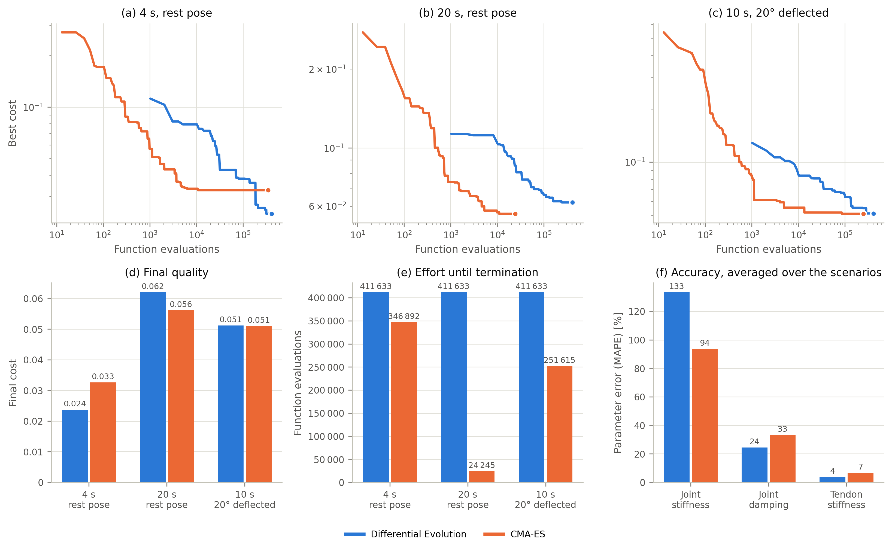
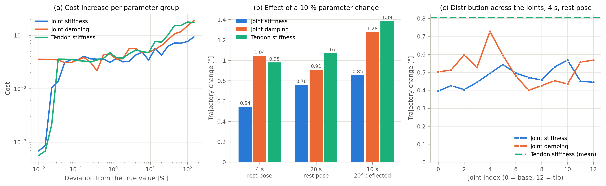
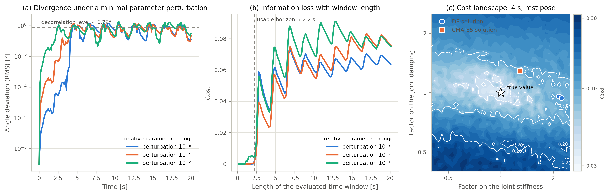

# Simulation-based identification

## TL;DR

Rather than measuring a part, fit the **whole robot's behaviour**: excite the
real system, replay the identical excitation in MuJoCo, and adjust the free
model parameters by numerical optimisation until the simulated response matches
the measured one.

The observable is the **joint-angle trajectory**. The optimiser is **CMA-ES**.
The cost is a weighted RMSE on positions plus a lightly weighted term on
velocities. The parameter count is kept down by describing the profile along the
joint chain with a low-degree polynomial instead of 13 independent values.

---

## The premise, and its honest caveat

A simulation can never fully match reality. Friction, material hysteresis and
thermal effects are either absent or heavily simplified in the model. The
consequence is that **the identified parameters need not correspond to the
robot's actual physical material properties**. They are the parameter
combination that best explains the observed behaviour *within the chosen model*.

For reinforcement learning this is, in principle, acceptable: what matters is
**behavioural equivalence** between simulation and reality, not parameter
identity. Whether that equivalence was actually achieved here is
[the results page](results.md).

## Cost function

The joint angles are the primary observable characterising the whole system.
Defined motion sequences are run on the real robot and the joint angles
`q_i(t)` recorded at high rate. The per-joint, per-sample angle error is

$$e_i[j] = q_{\text{gt},i}[j] - q_{\text{est},i}[j]$$

with `q_gt` measured and `q_est` simulated, `j` the discrete sample index.

**Errors are converted from radians to degrees before squaring** — a scaling by
`180/π ≈ 57`. This does not change the optimisation result, since it affects
every error term equally, but it keeps the cost in an interpretable range;
in radians the errors are well below 1 and would become very small numbers when
squared.

The cost combines a weighted position RMSE with a lower-weighted velocity term:

$$J = \sqrt{\sum_{i,j} w_i \, \tilde{e}^2_{i,\text{pos}}[j]} \;+\; \lambda_{\text{vel}} \sqrt{\sum_{i,j} w_i \, \tilde{e}^2_{i,\text{vel}}[j]}$$

`w_i` weights individual joints. **`λ_vel` balances two competing effects:**

* Too large, and the numerically much larger velocity errors dominate the cost,
  and the position deviation loses influence.
* Too small, and the damping information leaves the optimisation entirely —
  damping is observable mainly through joint velocity and shows up only weakly
  in pure position data.

A deliberately small value, `λ_vel = 0.05`, lets the velocity trajectory
contribute while the position trajectory stays dominant. Both `w_i` and `λ_vel`
were set **empirically from sim-to-sim pre-trials**, not derived analytically.

## Reducing the parameter count

Every joint could have its own stiffness, damping and friction. That produces a
great many parameters to optimise simultaneously, inflating the search space
unnecessarily and making the optimisation much harder.

Instead, the parameter profile along the joint chain is described by a
**low-degree polynomial**. This abstraction matches the expected physics: the
SpiRob's segments do not change abruptly from joint to joint but taper
continuously from base to tip, so a smooth parameter profile is plausible. With
a degree-3 polynomial the optimiser determines **four coefficients per quantity
instead of thirteen individual values**.

The same treatment is applied to the tendon parameters (stiffness, damping,
friction) and to globally acting MuJoCo-specific parameters. The **two tendons
are coupled to a shared value** because of their symmetric construction. The
resulting parameter vector is far smaller than independent optimisation of every
model quantity would give.

## Seeds and constraints

Starting values come from the [free-vibration identification](direct-measurement.md),
supplemented by a **uniform seed for joint friction**, for which no measurement
exists at all.

All variables are additionally held within **absolute bounds** to keep the
optimisation numerically stable. Two further safeguards protect against
physically inadmissible or numerically unstable combinations:

1. Every decoded value is clipped from below.
2. Any simulation that becomes unstable or returns an invalid result receives a
   **fixed high cost value instead of crashing**, so the cost function stays
   evaluable everywhere and the optimiser is led back out of such regions.

## Optimiser: DE, then CMA-ES

Initially **Differential Evolution** (Storn & Price, in SciPy's implementation)
was used. DE is an evolutionary global optimiser that needs no gradient
information and suits high-dimensional parameter spaces with many local minima,
where gradient-based methods fail.

Later the work switched to **CMA-ES** (Hansen, reference implementation
*pycma*). CMA-ES is also evolutionary, but adapts the **covariance matrix of its
search distribution** to the structure of the cost function. That lets it exploit
correlations and differing scales between parameters — exactly what is expected
between the stiffness and damping values of neighbouring joints — far more
efficiently than DE.

In practice on this problem CMA-ES proved superior: **better results, less total
compute, faster convergence to a minimum.** It is the default.

## Validation in a sim-to-sim scenario

Before applying the method to real data, its basic function was validated in a
controlled **sim-to-sim** setting: could the optimiser reconstruct known model
parameters from trajectory data at all?

The SpiRob was excited in simulation with known reference parameters and the
resulting joint-angle trajectories recorded as ground truth. The parameters were
then reset to different starting values, and the optimiser had to recover the
reference values from the trajectory data alone. With no external disturbances,
friction or measurement noise, this is the **best possible case** and gives an
**upper bound on achievable identification quality**.

Several configurations were compared — recording duration, compute budget,
starting pose — with DE and CMA-ES side by side. The common measure of effort is
the number of **function evaluations** (actual simulation runs), because one
generation means different amounts of work for the two methods. Per
configuration both work on the same ground truth and the same search space.

| Method | Duration | Start | Evaluations | Time [s] | Cost | Err. stiffness | Err. damping | Err. tendon |
|---|---:|---:|---:|---:|---:|---:|---:|---:|
| DE | 4 s | 0° | 206 633 | 68.3 | 2.68e-2 | 115.9 % | 4.3 % | 2.0 % |
| CMA-ES | 4 s | 0° | 206 635 | 124.8 | 3.26e-2 | 28.3 % | 29.4 % | 2.9 % |
| DE | 4 s | 0° | 411 633 | 133.4 | 2.38e-2 | 123.7 % | 6.1 % | 1.6 % |
| CMA-ES | 4 s | 0° | 346 892 | 209.2 | 3.26e-2 | 28.3 % | 29.4 % | 2.9 % |
| DE | 20 s | 0° | 206 633 | 294.5 | 6.26e-2 | 117.4 % | 18.4 % | 0.7 % |
| CMA-ES | 20 s | 0° | 24 245 | 53.8 | 5.61e-2 | 62.9 % | 31.0 % | 0.4 % |
| DE | 20 s | 0° | 411 633 | 578.3 | 6.20e-2 | 158.0 % | 16.9 % | 2.9 % |
| CMA-ES | 20 s | 0° | 24 245 | 53.1 | 5.61e-2 | 62.9 % | 31.0 % | 0.4 % |
| DE | 10 s | 20° | 411 633 | 302.0 | 5.12e-2 | 56.2 % | 12.7 % | 4.4 % |
| CMA-ES | 10 s | 20° | 251 615 | 306.2 | 5.10e-2 | 61.0 % | 21.9 % | 0.2 % |

Note where CMA-ES uses only 24 245 evaluations against DE's 206 633 and still
reaches a *lower* cost: it stops early on its own stagnation criterion rather
than spending the budget.

**Across every configuration:**

* **tendon stiffness** is recovered most reliably — errors below **5 %**
* **joint damping**: **4–31 %**
* **joint stiffness**: **28–158 %**

**Joint stiffness cannot be reliably reconstructed from trajectory data**, even
in the ideal case. That is not an optimiser failure; it is a statement about how
little information the trajectory carries about that parameter.

## Identification in the real-to-sim scenario

The real measurements are **smoothed with a moving-average filter** before
optimisation. Unfiltered high-frequency noise would tempt the optimiser into
fitting the measurement noise rather than the robot dynamics.

The optimisation was then run over 500 iterations, analogously to the sim-to-sim
case. To reflect later operating conditions, the trajectory again starts from a
deflected pose.

The optimiser **only roughly approximates the trajectory**. A satisfactory match
with the real motion is not achieved. This is reflected in the identified
parameter values: stiffness and damping fluctuate from joint to joint by
physically implausible orders of magnitude and show **no coherent distribution
along the robot's length**, which the logarithmic spiral geometry would lead one
to expect.

The identified values are therefore not a meaningful approximation of the
SpiRob's actual mechanical properties. They are a
**behaviourally optimal but physically implausible parameter combination** that
minimises the cost function within the chosen model.

### Why

This discrepancy traces back to **structural modelling gaps**. The MuJoCo model
abstracts the SpiRob as a chain of rigid segments with simple torsion
spring-damper joints, and therefore fails to represent essential aspects of the
real system:

* friction in the tendon guides,
* the non-linear material behaviour of TPU,
* coupling effects between neighbouring joints.

The optimiser compensates for these missing dynamics with unrealistic parameter
values. The identified numbers cannot be regarded as a reliable image of the
SpiRob's actual joint properties.

### The reduced parametrisation

To counter the implausible distribution, the **polynomial parametrisation** was
also tried. With a degree-3 polynomial the optimiser determines only four
coefficients per quantity instead of thirteen individual values. The MuJoCo
parameter *frictionloss*, modelling dry friction in the joints, was introduced
alongside and optimised through the same polynomial ansatz.

The polynomial approach **did not reach a lower cost** than the independent
parametrisation — but the cost was not significantly higher either. In exchange
it produced a **more plausible parameter distribution** across the joints, better
matching the profile expected from the logarithmic spiral geometry.

### Still open

Work in this area is **not finished**. Even with the reduced parametrisation and
the additional friction parameter, no satisfactory match with the real
trajectory is reached. Directions for further work:

* extend the model with **Euler–Eytelwein tendon friction**,
* adjust the cost function,
* use a **longer trajectory** as the basis for the optimisation.

Even so, the results give important insight into the **limits of simulation-based
system identification for continuum robots**, and form a well-founded basis for
discussing transfer strategies — see [Results & discussion](results.md).
