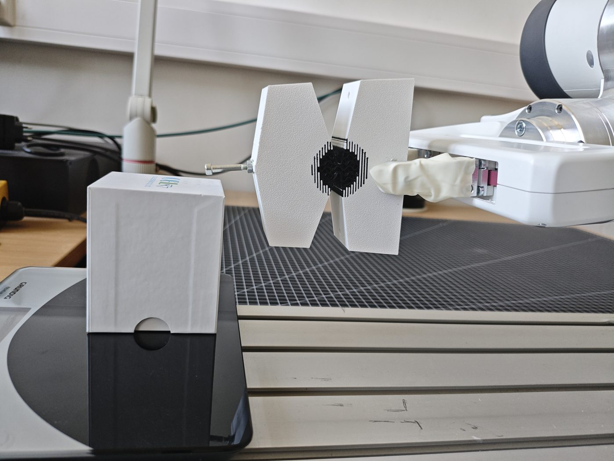
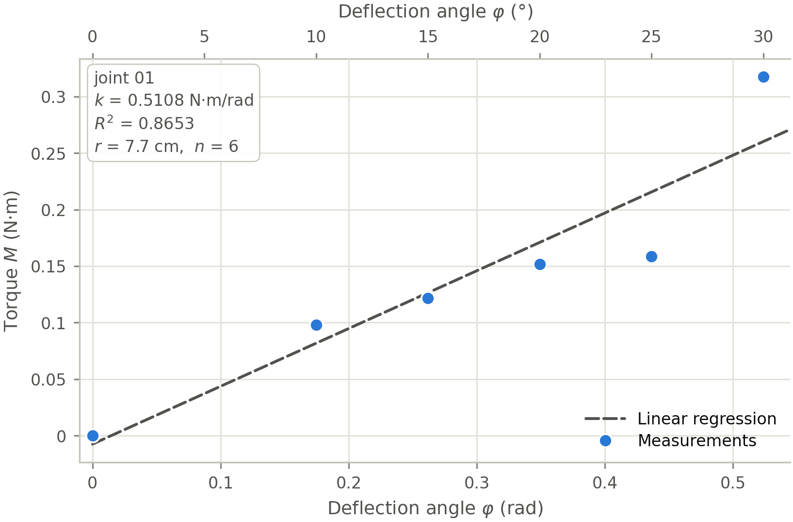
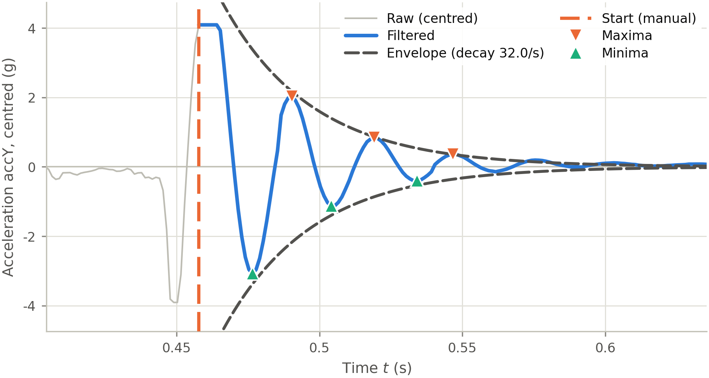
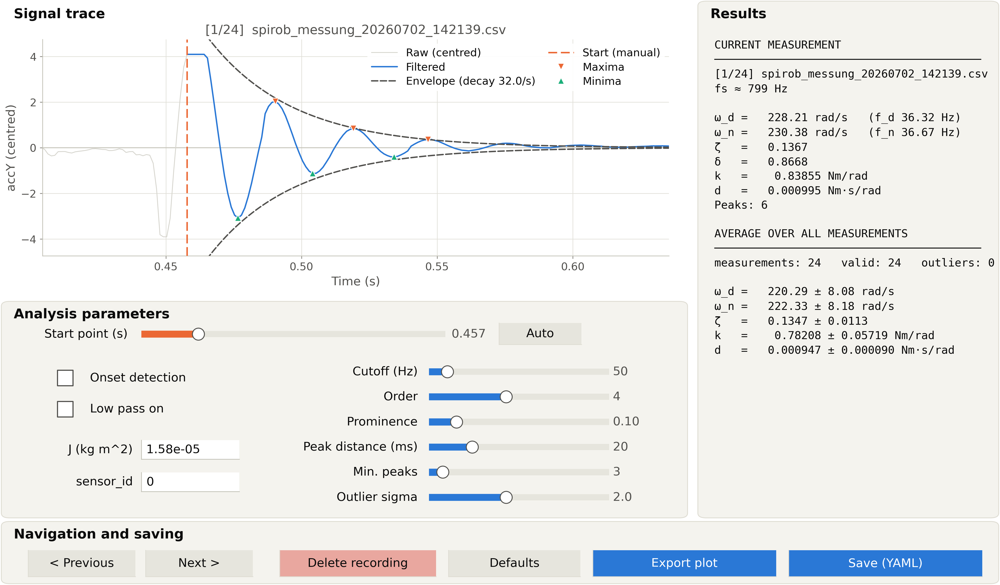
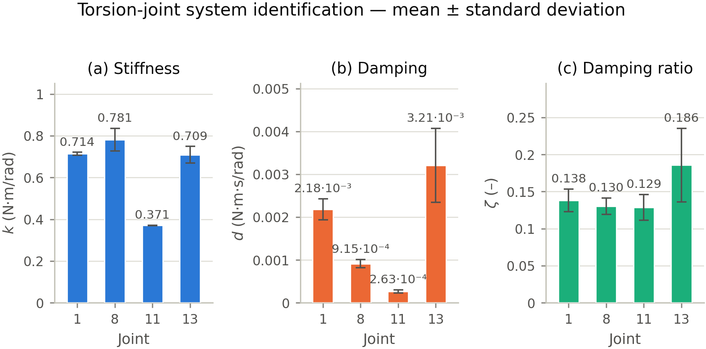

# Direct measurement

Measuring one isolated joint at a time on the physical robot.

## TL;DR

A joint cannot be measured on the assembled robot — deflecting one segment
always moves its neighbours. So one segment is clamped and the other is loaded.
Stiffness and damping are fundamentally different phenomena (a static restoring
moment vs. velocity-dependent dissipation), so they need two different
experiments:

| Script | Experiment | Yields |
|---|---|---|
| `static_load.py` | press the free segment onto a precision scale at a known lever arm; regress `M(φ)` | `k` |
| `free_vibration.py` / `free_vibration_gui.py` | deflect and release; read the ring-down off an accelerometer | `k`, `d`, `ζ` |
| `signal_editor.py` | trim/filter one raw recording by hand | cleaned CSV |

Four joints were measured — **1 (base), 8 (middle), 11, 13 (tip)** — spanning
the robot's length. Every other joint is linearly interpolated between them
(constant extrapolation at the ends), which is reasonable because the segment
size ratio is close to one, so parameters change gradually.

## Static load test

The joint is modelled as a linear torsion spring, so `M = k·Δθ`. The moment is
applied by pressing the free segment onto a scale at a known lever arm `r`,
always perpendicular to the lever, so `α = 90°` and `M = F·r` holds without ever
measuring `α`. A Franka Emika Panda holds the setup: the scale measures the
force (more accurate than the arm's own joint-torque estimate) and the arm's
joint encoders give the angle (±0.1 mm repeatability at the end effector, better
than a protractor's ±0.5° or the ±0.2° of photo-based angle reading).



```bash
uv run sysid/direct/static_load.py                # all four joints
uv run sysid/direct/static_load.py --joint joint_01
```



The script reports two fits. The free-intercept regression is the headline
number; its intercept comes out slightly non-zero although physically it should
vanish at `φ = 0`, so it is printed but kept out of the figure. The
through-origin fit is printed alongside — for joint 1 it gives 0.4921 instead of
0.5108 N·m/rad at practically the same R², which is the price of forcing the
zero crossing.

**A known systematic error:** the weight of the deflected segment itself was not
compensated. Since the force is measured along gravity, the segment's own mass
enters the reading and biases `k`.

## Free vibration (logarithmic decrement)

One segment is clamped so exactly one joint can swing — **in a horizontal
plane**. The joint axis stands vertical, so gravity acts parallel to it, adds no
restoring moment and appears only as a constant offset on the axis-parallel
sensor channel. No gravity compensation is needed, by construction.

A three-axis accelerometer sits at a known radius with its y-axis along the
tangential direction, so `θ̈ = a_t / r_s` directly.

**The angle is never reconstructed by double integration** — noise and offset
would drift. It does not need to be: the second derivative of

```
θ(t) = A·e^(−Dω₀t)·cos(ω_d t + φ)
```

has the *same* envelope and the *same* damped frequency, differing only in
amplitude (by ω₀²) and phase. The constant amplitude factor cancels inside the
logarithmic decrement, so the ring-down can be read straight off the
acceleration:

```
Λ  = ln(A_i / A_{i+1})              from successive extrema
D  = Λ / sqrt(4π² + Λ²)
k  = (ω_d / sqrt(1 − D²))² · J
d  = 2·D·ω_d / sqrt(1 − D²) · J
```



That Λ stays near-constant over successive maxima, and that the decay fits an
exponential envelope, confirms the damping is predominantly **viscous** — dry
friction would produce a *linear* amplitude decay instead.

### The moment of inertia is the weak link

`k` and `d` both scale **linearly with `J`**, and `J` is not measured. It is
estimated from the weighed segment mass through a simplified geometric
approximation, because the mass of a 3D-printed part cannot be derived
accurately from CAD (varying infill density, print tolerances). A relative error
in `J` transfers one-for-one into `k`.

`J` is **hand-tuned per joint in the GUI** and stored under `settings.J` in each
`data/free_vibration/joint_NN/sysid_settings.yaml`. Those YAML `results` are the
reference values that seed the real-to-sim fit.

The damping ratio `ζ` is the sanity check: it follows from the decrement alone,
is independent of `J`, and comes out at 0.125–0.133 across all four joints.

### Running it

```bash
# interactive — this is where J and the per-file start points are tuned
uv run sysid/direct/free_vibration_gui.py data/free_vibration/joint_08

# render the interface as a figure, windowless
uv run sysid/direct/free_vibration_gui.py data/free_vibration/joint_08 --figure

# batch over every joint folder
uv run sysid/direct/free_vibration.py
```



The batch script reads each folder's `sysid_settings.yaml` for `J`, `sensor_id`
and the analysis parameters, but it does **not** apply the per-file manual start
points — those exist only in the GUI. Expect the batch run to differ from the
YAML `results` block by a few percent. **The YAML values are authoritative.**



## Long-term behaviour

Cyclic tests on joints 1 and 13 showed the bending moment dropping continuously
with cycle count — about 25 % over 100 cycles at the solid-printed tip joint 13,
about 16 % over 500 cycles at the infill-printed base joint 1. That points to
progressive material fatigue independent of print structure. The two joints
differ in geometry and load as well as in print structure, so the difference
cannot be attributed to infill alone. The raw data for these tests lives with
the robot-arm tooling, not in this repository.
